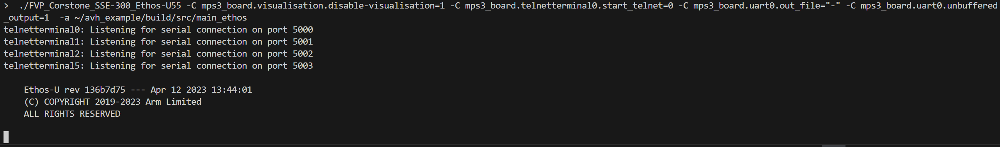
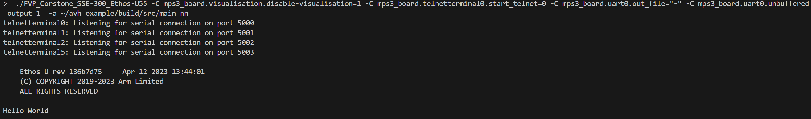
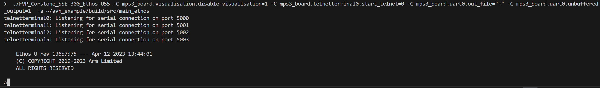
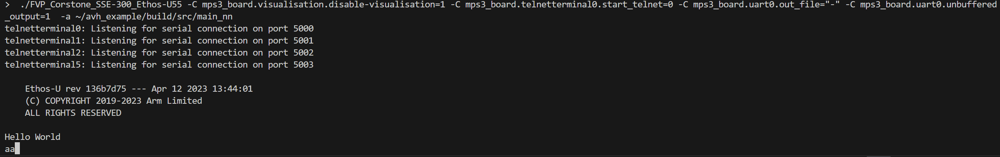
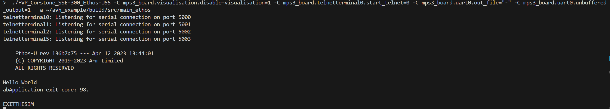
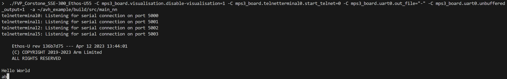

This repo is trying to use the files from [ethos-u-platform](https://review.mlplatform.org/plugins/gitiles/ml/ethos-u/ethos-u/) to setup a test framework like [CMSIS-NN test](https://github.com/ARM-software/CMSIS-NN/tree/main/Tests/UnitTest) on [FVP_Corstone_SSE-300](https://developer.arm.com/downloads/-/arm-ecosystem-fvps).
# Compiler
arm-gnu-toolchain-13.2.rel1-x86_64-arm-none-eabi

# Compile
```bash
bash cmake_build.sh
```

# Overview
[arm-none-eabi-gcc.cmake](cmake/arm-none-eabi-gcc.cmake) the toolchain copied from [ethos-u-core-platform/cmake/toolchain/arm-none-eabi-gcc.cmake](https://review.mlplatform.org/admin/repos/ml/ethos-u/ethos-u-core-platform)  
 [nn_test](src/nn_test/) is the test setup copied from [CMSIS-NN](https://github.com/ARM-software/CMSIS-NN/tree/main/Tests/UnitTest/Corstone-300) tests.  
 [ethos_test](src/ethos_test/) is the test setup copied from [ethos-u-core-platform/targets/corstone-300](https://review.mlplatform.org/admin/repos/ml/ethos-u/ethos-u-core-platform) and [ethos-u-core-platform/drivers/uart/](https://review.mlplatform.org/admin/repos/ml/ethos-u/ethos-u-core-platform)

# Run
 ```
 /path/to/FVP_Corstone_SSE-300/models/Linux64_GCC-9.3/FVP_Corstone_SSE-300_Ethos-U55 -C mps3_board.visualisation.disable-visualisation=1 -C mps3_board.telnetterminal0.start_telnet=0 -C mps3_board.uart0.out_file="-" -C mps3_board.uart0.unbuffered_output=1  -a /path/to/repo/build/src/main_ethos
 
/path/to/FVP_Corstone_SSE-300/models/Linux64_GCC-9.3/FVP_Corstone_SSE-300_Ethos-U55 -C mps3_board.visualisation.disable-visualisation=1 -C mps3_board.telnetterminal0.start_telnet=0 -C mps3_board.uart0.out_file="-" -C mps3_board.uart0.unbuffered_output=1  -a /path/to/repo/build/src/main_nn
```

# Problems
1. Ethos test **cannot** print "Hello World" on the terminal.


2. Uncomment line 14 in [src/main.c](src/main.c), ethos test **cannot** print "Hello world", but print 'a' correctly. While nn test print 'Hello World', 'a' and an **extra** 'a'.


3. Uncomment line 15 in [src/main.c](src/main.c), **both** tests print correctly.

